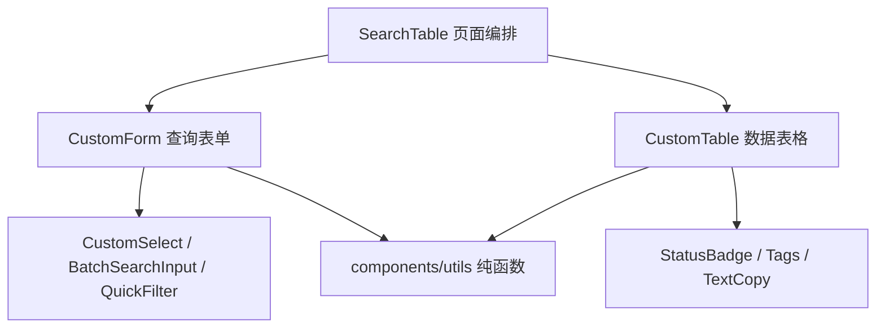

# 组件现状及未来开发模板规范

> 项目：mg-dscp-admin（Vue 2 + Vue CLI 4 + Element UI）  
> 分析方式：基于 Graphify 依赖图、组件目录静态扫描及当前源码交叉核对  
> Graphify 快照：`all-graphify-out-0729`，7,322 个节点、10,094 条边、548 个社区  
> 注意：图谱对应的代码提交早于当前工作区，因此本文中的依赖数量用于判断趋势和优先级；实施前仍需对目标文件做一次源码复核。

## 1. 结论摘要

当前项目已经具备公共组件体系的雏形，但仍处于“新旧两套体系并存”的阶段：

1. `src/components` 中既有成熟的基础组件，也有历史通用组件、配置驱动组件和大型业务工具。
2. 新一代配置驱动体系以 `SearchTable + CustomForm + CustomTable + CustomSelect + components/utils` 为主，结构方向合理，但目前主要在物流轨迹页面验证，尚未形成全项目统一标准。
3. `PageComponents` 承载了较多历史页面能力，职责宽泛，继续扩展会进一步增加耦合，应进入“只维护、不新增”的状态。
4. `FrontTools` 中存在超大型业务组件，依赖度很高，但其本质并不是跨业务通用 UI，不适合继续放在公共组件根目录。
5. 上传、编辑器、图片处理等功能存在多套相似实现，应先统一底层能力和契约，再保留场景化薄封装，不能直接合并成一个巨型万能组件。
6. Vue 3 升级不应从业务页面大规模重写开始，应先稳定组件 API 和纯工具函数，再按依赖由低到高逐层迁移。

未来推荐的主线是：

```text
components/utils
    ↓
基础原子组件
    ↓
CustomSelect / ButtonGroup / Section 等轻量组件
    ↓
CustomForm / CustomTable
    ↓
SearchTable 页面编排层
    ↓
业务页面私有组件
```

## 2. 当前组件资产概况

### 2.1 目录与使用规模

静态扫描结果显示：

- `src/components` 下约有 43 个一级组件目录。
- 公共 Vue 文件约 57 个。
- 约 17 组组件包含 README 文档。
- 约 14 组组件有两个及以上显式导入方。
- 约 20 组组件只有一个显式导入方。
- 约 9 组组件未发现显式导入。

这里的“显式导入”只统计源码中的直接 import。通过全局注册、barrel export、动态组件、字符串组件名、路由配置或模板自动解析产生的使用关系，可能不会被完全统计。因此，“零导入”只能作为待核查清单，不能直接作为删除依据。

### 2.2 使用度较高的组件

显式导入数量较高的组件或组件组包括：

| 组件/目录                  | 显式导入方数量 | 当前判断               |
| ---------------------- | ------: | ------------------ |
| `PageComponents`       |      25 | 历史通用能力中心，职责过宽      |
| `components/utils`     |      23 | 新组件体系的重要基础，应重点建设   |
| `Editor`               |      17 | 使用面较广，但存在新旧实现并存    |
| `InputNumber`          |       6 | 可继续作为稳定基础组件维护      |
| `SIdentify`            |       6 | 场景明确，保持独立          |
| `ExportCurrencySelect` |       4 | 具有业务语义，需明确归属层级     |
| `FrontTools`           |       4 | 使用方不多，但内部复杂度和依赖度极高 |
| `ImgUpload`            |       4 | 与其他上传组件存在能力重叠      |
| `CustomSelect`         |       3 | 新组件体系基础组件          |
| `Pagination`           |       3 | 稳定基础组件             |
| `Tags`                 |       3 | 新组件体系展示组件          |
| `BatchSearchInput`     |       2 | 新配置驱动组件            |
| `CustomTable`          |       2 | 新组件体系核心，但推广范围仍有限   |
| `FileImportUpload`     |       2 | 文件导入场景组件           |

### 2.3 新一代 barrel export 组件

`src/components/index.js` 当前统一导出了以下组件：

- `BatchSearchInput`
- `BulkSearch`
- `ButtonGroup`
- `CardList`
- `CustomForm`
- `CustomSelect`
- `CustomTable`
- `FileImportUpload`
- `QuickFilter`
- `SearchTable`
- `Section`
- `StatusBadge`
- `Tags`
- `TextCopy`
- `VirtualList`

目前新组件体系的主要业务验证点集中在 `src/views/logistics/tracking`：

- 页面使用 `CardList`、`SearchTable`。
- 表格列使用 `StatusBadge`、`Tags`、`TextCopy`。

这说明新体系已经完成一个较复杂页面的落地，但尚不足以证明它适用于所有 CRUD 页面、弹窗密集页面和高复杂业务页面。建议再选择两类页面作为样板验证：

1. 一个常规查询、表格、分页、编辑弹窗页面。
2. 一个中等复杂度、包含批量操作和多状态联动的页面。

报价、账单、1688 映射等高复杂核心页面不适合作为第一批推广对象。

## 3. 当前组件体系分层

### 3.1 平台与布局组件

典型内容包括 Breadcrumb、Hamburger、SvgIcon、Pagination 等。

特点：

- 与后台框架、导航和整体布局关系紧密。
- 复用范围稳定。
- 业务语义较少。

建议：作为稳定层维护，原则上只修复缺陷和补充兼容性，不承载具体业务规则。

### 3.2 历史通用组件

典型内容包括 `PageComponents`、旧版 Editor、部分上传组件和页面工具组件。

特点：

- 形成时间较早，使用范围较广。
- 常将表单、搜索、上传、弹窗和业务判断混合在一起。
- API 和插槽契约不完全统一。

建议：标记为 Legacy。保留现有调用方，禁止新增功能；当业务页面发生真实改动时，再逐项迁移到新组件体系。

### 3.3 配置驱动组件体系

核心链路为：



优点：

- 配置和页面状态开始分离。
- 公共字段映射、监听器、样式、对象读取等能力已下沉至 `components/utils`。
- 表格列可以通过工厂函数注入回调，降低对页面 `this` 的耦合。
- 与未来 Vue 3 迁移需要的“显式 props、events、slots 契约”方向一致。

当前风险：

- `SearchTable`、`CustomTable` 本身已较复杂。
- 若继续把所有业务能力加入顶层组件，会重新形成万能组件。
- 当前真实业务覆盖面仍偏窄。

建议：将其确定为未来主线，但必须控制职责边界。

### 3.4 大型业务工具组件

`FrontTools` 是当前最明显的边界问题。Graphify 中的高连接节点包括：

- `ExcelToPdfTool.vue`：约 7,666 行，图谱度数约 120。
- `ApiToPdfTool.vue`：约 1,674 行，图谱度数约 48。
- `FrontTools/index.vue`：约 1,487 行。

这些文件将 Excel、PDF、打印、接口请求、状态管理和 UI 编排集中在单文件中。其高连接度更多代表“内部职责多、依赖复杂”，不代表它适合作为通用组件。

建议：

- 将页面入口逐步迁移到 `src/views/toolBox` 或 `src/features/document-tools`。
- 将 Excel 解析、PDF 数据转换、打印参数处理等纯逻辑抽到 `helper.js` 或明确的工具模块。
- UI 子块只在确有复用时抽为组件。
- 迁移时保持现有入口和调用契约，不做一次性重写。

### 3.5 页面私有业务组件

页面私有组件数量较多的模块包括：

- `productsLib/local`：约 21 个。
- `billManage/billDetails`：约 11 个。
- `business/order`：约 9 个。
- `productsLib/quotation`：约 8 个。
- `purchaseManage/1688proMap`：约 7 个。

这些组件与页面状态和业务规则高度相关，保留在 `src/views/<module>/<page>/components` 是合理的。只有满足以下条件时才应提升到 `src/components`：

1. 至少存在两个真实跨页面调用方。
2. 组件名称不依赖具体业务对象。
3. API 可以通过 props、events、slots 和 ref 清楚表达。
4. 不直接调用某个具体业务 API，或 API 能通过函数参数注入。
5. 样式不依赖某个页面 DOM 结构。

## 4. 主要问题与风险

### 4.1 新旧体系长期并存

如果不设定迁移方向，后续开发会继续在 `PageComponents`、旧组件和新配置组件之间随机选择，造成：

- 同一类页面交互不一致。
- 同类缺陷需要在多处修复。
- Vue 3 迁移时需要同时兼容多套契约。
- 新开发者难以判断应该复用哪个组件。

### 4.2 公共组件目录混入业务应用

`FrontTools` 等模块更接近独立业务工具，却位于公共组件目录。这样会导致公共组件边界失真，并使依赖分析误判其复用价值。

### 4.3 重复能力尚未形成统一底座

上传能力散落于：

- `FileUpload`
- `FileImportUpload`
- `ImageUpload`
- `ImageUploadOSS`
- `ImgUpload`
- `PageComponents/newUpload`
- `PageComponents/searchByImg`

编辑器也存在 `Editor/index.vue` 和 `Editor/indexOrigin.vue` 等并行实现。

不建议直接合并成一个包含全部业务分支的万能组件。正确方式是先统一底层能力，例如：

- 文件校验：类型、大小、数量。
- 上传请求适配。
- 上传进度和取消。
- 结果标准化。
- 错误归一化。
- 预览和删除事件契约。

上层继续保留“图片上传”“文件导入”“搜索图片”等薄封装。

### 4.4 Vue 2 隐式契约较多

组件中存在 `$listeners`、`$attrs`、`inheritAttrs`、`beforeDestroy`、`.sync`、`.native`、`slot-scope` 等 Vue 2 特有或在 Vue 3 中发生变化的写法。

仅在组件目录中就观察到：

- `$listeners`：约 12 个文件。
- `$attrs`：约 15 个文件。
- `inheritAttrs`：约 16 个文件。
- `beforeDestroy`：约 14 个文件。
- window 监听的添加和移除：各约 7 处。

这些不是当前必须立即修复的问题，但应纳入组件契约台账，避免 Vue 3 升级时遗漏事件透传、生命周期清理和双向绑定行为。

## 5. 未来组件状态管理规范

每个公共组件必须标记一种生命周期状态：

| 状态 | 含义 | 开发规则 |
| --- | --- | --- |
| Stable | 已在多个页面验证 | 允许新增兼容能力，禁止破坏契约 |
| Experimental | 新组件，验证范围有限 | 允许调整，但必须同步升级调用方 |
| Internal | 仅供某个组件组内部使用 | 不对业务页面承诺公共 API |
| Layout | 平台布局组件 | 只处理框架与布局职责 |
| Legacy | 历史组件 | 只修缺陷，不增加新业务功能 |
| Deprecated | 已有明确替代组件 | 禁止新增调用方，制定迁移清单 |
| Business | 带明显业务语义 | 应迁移至业务模块或 feature 目录 |

建议在每个组件 README 顶部记录：状态、负责人、适用范围、替代组件、Vue 3 兼容情况。

## 6. 新增公共组件的开发模板

### 6.1 推荐目录结构

```text
src/components/XxxComponent/
├── index.vue           # 组件入口，只保留 UI 状态和交互编排
├── const.js            # 固定枚举、默认配置、事件名、尺寸常量
├── helper.js           # 无副作用的转换、校验、归一化函数
├── components/         # 仅供本组件使用的内部子组件
├── README.md           # 公共 API、示例、状态和迁移说明
└── __tests__/          # 条件允许时补充 helper 与组件契约测试
```

简单组件无需机械创建全部文件，但一旦出现大段固定配置或纯数据转换，必须分别下沉到 `const.js` 和 `helper.js`。

### 6.2 `index.vue` 职责

只保留：

- 响应式状态。
- computed 中的状态派生和参数传递。
- 用户交互编排。
- 子组件协调。
- 生命周期内的资源初始化和清理。

禁止：

- 大段固定字段配置。
- 与组件状态无关的纯转换逻辑。
- 直接复制其他组件的大段相似实现。
- 直接耦合具体业务页面的 Vuex module、router name 或 API。

### 6.3 props 设计规范

- props 名称表达数据含义，不表达父页面来源。
- 对象和数组必须使用工厂函数作为默认值。
- 对复杂对象提供清晰的字段结构说明。
- 不在子组件中直接修改 prop。
- 布尔值统一使用正向命名，如 `disabled`、`clearable`、`showToolbar`。
- 需要兼容 Element UI 时，通过明确的 `xxxProps` 对象透传，而不是无限制接收所有参数。

### 6.4 事件设计规范

- Vue 2 双向绑定统一使用 `value` prop 和 `input` 事件。
- 业务完成事件使用 `confirm`、`success`，取消使用 `cancel`。
- 表单值变化使用 `change`，不要用多个语义重叠的事件。
- 事件参数必须稳定，不随内部实现改变。
- 包装 `el-dialog`、`el-drawer` 等组件时，声明自有事件集合，过滤后再透传剩余监听器。
- 事件触发顺序必须写入 README，尤其是 `input`、`change`、`confirm`、`close` 的先后关系。

### 6.5 插槽规范

- 优先使用具名插槽表达结构扩展点。
- 插槽参数必须使用稳定字段，不直接暴露整个内部组件实例。
- 不通过插槽让父组件依赖内部 DOM 层级。
- 为默认插槽提供可用的默认渲染。
- Vue 3 迁移前记录 `slot-scope` 对应的新 `v-slot` 契约。

### 6.6 ref 命令式 API

仅在弹窗、抽屉、上传器等确有需要时暴露：

```js
open(payload)
close()
reset()
validate()
```

要求：

- `open(payload)` 返回 `boolean` 或 Promise，明确是否成功打开。
- 不允许父组件通过 ref 随意读写内部 data。
- README 必须说明参数和返回值。
- Vue 3 迁移时可直接映射到 `defineExpose` 或兼容层公开方法。

### 6.7 样式规范

- 优先复用项目 Design Token 和 Element UI 变量。
- 公共组件不得依赖页面级 class 或特定祖先选择器。
- 不使用深层 DOM 选择器绑定 Element UI 内部非稳定结构，确需覆盖时集中说明原因。
- 设置明确的最小宽度、溢出和空状态策略。
- 弹窗、抽屉、下拉框需检查 z-index、滚动容器和 body 挂载行为。

### 6.8 资源与内存清理

所有以下行为必须成对处理：

- `window.addEventListener` / `removeEventListener`
- `document.addEventListener` / `removeEventListener`
- 定时器创建 / 清除
- `ResizeObserver.observe` / `disconnect`
- 第三方实例创建 / destroy
- 未完成请求 / 取消或忽略过期响应

Vue 2 使用 `beforeDestroy` 清理；设计时同时记录 Vue 3 对应的 `beforeUnmount`。

## 7. 业务页面未来开发模板

推荐沿用 `src/views/logistics/tracking` 的页面结构：

```text
views/<module>/<page>/
├── index.vue
├── const.js
├── helper.js
├── tableColumns.js
└── components/
    ├── index.js
    ├── readme.md
    ├── XxxDialog.vue
    └── XxxDrawer.vue
```

文件职责：

| 文件 | 应承担的职责 |
| --- | --- |
| `index.vue` | 页面状态、接口编排、组件协调、用户操作流程 |
| `const.js` | 稳定枚举、按钮配置、查询字段、分页和虚拟滚动参数 |
| `helper.js` | 查询构建、数据转换、格式化、校验等纯函数 |
| `tableColumns.js` | 表格列工厂和 render 配置，通过参数注入回调 |
| `components` | 仅属于当前页面的弹窗、抽屉和复杂 UI 块 |

### 7.1 SearchTable 页面模板要求

- `queryParams` 通过 `createQueryParams()` 初始化。
- 查询表单通过 `createQueryFormItems(...)` 构建。
- 表格列通过 `createTableColumns({ onXxx })` 注入事件。
- 查询参数由 `helper.js` 中的 `buildXxxQuery` 统一转换。
- API 函数从 `src/api` 模块引入，不在组件中直接拼接 URL。
- 分页参数优先使用项目统一配置：`current`、`size`、`data.records`、`data.total`。

### 7.2 弹窗和抽屉模板要求

- 使用 `value + input` 支持 `v-model`。
- 暴露 `open(payload)` 和 `close()`。
- 业务成功发出 `confirm`，用户取消发出 `cancel`。
- 自管表单草稿，关闭后按业务要求重置。
- props 和 listeners 透传前过滤组件自有字段及事件。
- 异步提交期间防止重复请求。
- README 记录 `open()` 参数结构、事件载荷和默认行为。

## 8. 公共组件准入标准

新增到 `src/components` 前必须回答：

1. 是否已有组件能通过 props、插槽或少量配置满足需求？
2. 是否存在至少两个真实复用场景？
3. 是否包含具体业务 API、权限码、路由名或页面状态？
4. props、events、slots、ref API 是否能独立描述？
5. 是否能在不依赖业务页面的情况下演示和测试？
6. 是否与现有组件形成重复能力？
7. Vue 3 中是否存在明确的迁移映射？

若第 2 项不满足或第 3 项为“是”，优先放入页面私有 `components`，待出现真实复用后再上移。

## 9. 现有组件治理计划

### 第一阶段：建立台账和停止扩散

- 给公共组件补充状态标签。
- 将 `PageComponents` 标记为 Legacy，停止新增能力。
- 将 `FrontTools` 标记为 Business。
- 标记零显式导入和单调用方组件，核查动态注册后再决定去留。
- 固化新组件的 props、events、slots 和 ref API。

### 第二阶段：验证新模板

- 在一个常规 CRUD 页面使用新模板。
- 在一个中等复杂页面验证批量操作、弹窗和异常分支。
- 补齐 `CustomForm`、`CustomTable`、`SearchTable` 的 README 和示例。
- 对 `components/utils` 中纯函数增加单元测试。

### 第三阶段：统一底层能力

- 抽取上传校验、请求适配、结果归一化、错误归一化 helper。
- 确定 Editor 主版本，旧版本进入 Deprecated。
- 将重复的监听器过滤、对象读取、选项映射统一复用 `components/utils`。
- 拆出 SearchTable 中可独立维护的工具条、全屏和响应解析能力。

### 第四阶段：按修改触发迁移

- 不进行全项目批量搬迁。
- 页面发生业务改动时，同步迁移相关 Legacy 组件。
- 保持旧 API 的兼容适配层，完成调用方迁移后再删除。
- 大型工具按功能边界逐步迁移至业务 feature 目录。

## 10. Vue 3 迁移顺序

推荐按依赖由低到高迁移：

1. `components/utils` 纯函数。
2. `StatusBadge`、`Tags`、`TextCopy` 等轻量展示组件。
3. `CustomSelect`、`ButtonGroup`、`Section` 等基础交互组件。
4. `CustomForm`。
5. `CustomTable`。
6. `SearchTable`。
7. 仍在使用的历史组件。
8. `FrontTools` 等大型业务工具。

迁移前必须冻结并记录：

- `value/input` 与 `v-model` 行为。
- `.sync` 对应的 `update:xxx` 事件。
- `.native` 事件由谁承接。
- `$listeners` 与 `$attrs` 合并后的透传规则。
- 具名插槽和作用域插槽参数。
- ref 暴露方法。
- 生命周期内资源清理。

## 11. 测试与验收规范

### 11.1 纯函数测试

重点覆盖：

- 空值、缺失字段和异常类型。
- 默认配置与显式配置。
- 字段映射和结果归一化。
- 查询参数清理。
- 上传类型、大小和数量边界。

### 11.2 组件契约测试

重点覆盖：

- props 默认值和显式覆盖。
- `value/input` 双向绑定。
- 事件载荷和触发顺序。
- 插槽默认内容及自定义内容。
- `$attrs`、listeners 的透传和过滤。
- `open/close/reset/validate` 等 ref API。
- loading、empty、error、disabled 状态。

### 11.3 页面回归测试

重点覆盖：

- 首次查询、条件查询、重置和分页。
- 表格选择、批量操作和无选中确认。
- 新增、编辑、取消、提交失败和重复提交。
- 权限按钮显示与接口权限失败。
- 文件上传、进度、失败重试和移除。
- 弹窗关闭后的状态重置。
- 路由离开后监听器、定时器和观察器是否释放。

## 12. 禁止事项

- 禁止继续向 `PageComponents` 添加新的业务能力。
- 禁止为了“看起来复用”而提前把单页面组件放进公共目录。
- 禁止创建包含所有上传场景的巨型万能上传组件。
- 禁止公共组件直接依赖具体业务 API、权限码或路由名。
- 禁止在 `index.vue` 中堆积大段固定配置和纯转换函数。
- 禁止通过 ref 直接读写子组件内部 data。
- 禁止未核查动态注册就删除“零显式导入”组件。
- 禁止在没有兼容层和调用方清单的情况下破坏现有组件 API。
- 禁止把 Vue 3 升级等同于一次性重写全部业务组件。

## 13. 建议优先处理清单

| 优先级 | 工作项 | 目标 |
| --- | --- | --- |
| P0 | 固化新组件 API，补充状态标签 | 阻止组件体系继续分叉 |
| P0 | 停止扩展 `PageComponents` | 控制历史债务增长 |
| P1 | 再完成两个样板页面 | 验证新模板的适用范围 |
| P1 | 建立上传底层 helper | 减少重复校验和请求逻辑 |
| P1 | 拆分 SearchTable 非核心能力 | 避免形成新的万能组件 |
| P2 | 迁移 `FrontTools` 目录归属 | 恢复公共组件边界 |
| P2 | 核查低使用率组件 | 形成 Deprecated/删除候选清单 |
| P2 | 建立 Vue 3 兼容台账 | 降低未来升级风险 |

## 14. 最终建议

当前项目不缺组件，缺的是明确的组件分层、生命周期状态、公共准入标准和迁移纪律。最稳妥的方向不是重新开发一套组件库，而是：

1. 将 `components/utils + CustomForm + CustomTable + CustomSelect + SearchTable` 确立为未来主线。
2. 用两个额外业务页面验证并修正其边界。
3. 将 `PageComponents` 冻结为 Legacy。
4. 将大型业务工具移回业务域。
5. 对上传、编辑器等重复能力统一底层契约，保留场景化薄组件。
6. 采用“页面发生修改时顺带治理”的渐进策略。
7. 在 Vue 3 升级前先冻结组件 API，并从纯函数和低依赖组件开始迁移。

这样既能控制当前 Vue 2 项目的改造风险，也能为未来 Vue 3 升级形成清晰、可执行的迁移路径。

