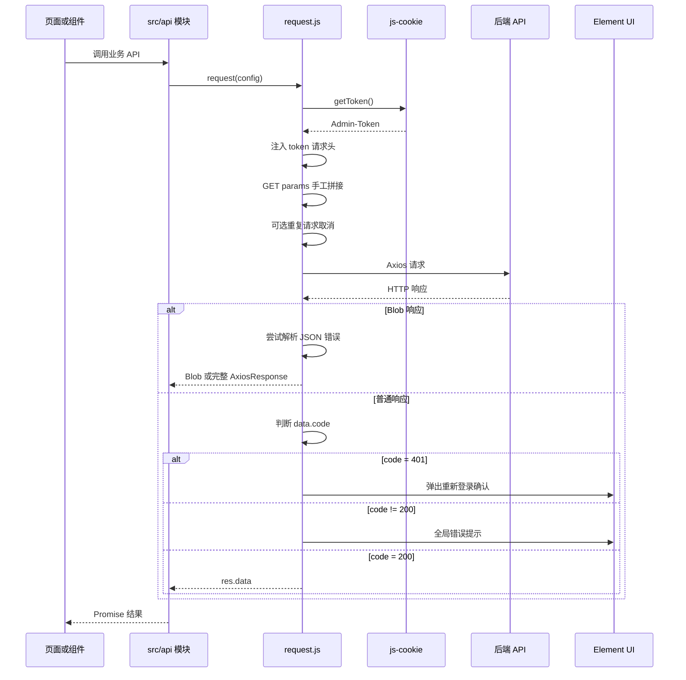

> 项目：mg-dscp-admin（Vue 2 + Axios 0.21.0 + Element UI）  
> 分析范围：`src/utils/request.js`、鉴权 Cookie、API 模块、下载工具、批量请求、上传组件、环境配置及主要调用方

## 1. 总体结论

当前项目的 `request` 封装已经成为事实上的全局请求基础设施：`src/api` 下共 89 个 JavaScript 文件，其中 87 个引入了 `src/utils/request.js`，静态检索到约 841 处 `request({...})` 调用。它统一承担了：

- API `baseURL` 和默认超时。
- 前端 Cookie Token 读取及请求头注入。
- GET 参数序列化。
- 业务状态码判断。
- 登录失效弹窗和跳转。
- 全局错误消息。
- Blob 文件流处理。
- 可选重复请求取消。
- 可选延迟返回。

这种集中封装减少了业务页面重复代码，但当前单文件同时承担“传输、鉴权、业务协议、UI 提示、路由跳转、并发控制、下载适配”等多种职责，已经出现多处全局性风险。

综合判断：

1. 当前封装可以继续作为 Vue 2 阶段的统一入口，不需要推倒重写。
2. 应先修复确定性缺陷，再拆分纯 helper 和策略模块。
3. 不建议一次性改变全部 API 返回结构，否则 841 处调用会产生大面积回归。
4. 推荐通过兼容层分阶段治理，并为未来 Axios 升级、Vue 3 和 HttpOnly Session 方案预留接口。

## 2. 当前请求链路



## 3. 当前实现拆解

### 3.1 Axios 实例

`src/utils/request.js` 创建单一 Axios 实例：

- `baseURL`：`process.env.VUE_APP_BASE_API`。
- 默认超时：3 分钟。
- 全局修改 `axios.defaults.headers['Content-Type']` 为 JSON。

当前开发和生产环境都将 `VUE_APP_BASE_API` 配置为绝对 HTTPS 地址。浏览器会直接请求对应 API 域名，而不是使用当前页面同源路径。

### 3.2 Token 注入

`src/utils/auth.js` 使用 `js-cookie` 读写 `Admin-Token`。请求拦截器在每次请求前读取 Token，并设置：

```text
token: <Admin-Token>
```

通过 `config.headers.isToken === false` 可以跳过 Token 注入。

注意：这里的 `isToken` 实际语义是“是否禁用 Token”，变量名与行为相反；并且 `isToken` 被放在真实 HTTP headers 对象中，若未主动移除，可能作为无意义请求头发给后端。

### 3.3 GET 参数处理

拦截器不使用 Axios 自带 params 序列化，而是遍历 `config.params`，将参数直接拼到 `config.url`，随后把 `config.params` 清空。

对象参数会被拼成：

```text
field[key]=value
```

数组也会被当作普通对象，最终形成带数字下标的参数。

### 3.4 业务状态码处理

普通响应默认读取：

```text
res.data.code || 200
```

处理规则：

- `200`：返回 `res.data`。
- `401`：弹出重新登录确认框。
- `500`：显示 Message，并 reject Error。
- 其他非 200：显示 Notification，并 reject 字符串。

### 3.5 重复请求取消

当 API 配置 `isCancelToken: true` 时，使用 Axios `CancelToken` 保存请求。新请求到来后会取消前一个相同键的请求。
1. **错误分支用错 config**（request.js:193）：`resposeCnfigSelf` 是「上一次成功响应」的 config（request.js:142），不是被取消请求自己的 config，删除 pending 的 key 可能删错，导致去重 map 残留。而且这里还有隐藏竞态——拦截器在取消旧请求后（request.js:89 已先 delete），新请求马上用**同一 key** 注册新 source（request.js:95），旧请求的 error 回调若再用 key 去 delete，会把新请求的记录误删。可如下修改
	1. ![[Pasted image 20260804135816.png]]
2. **取消后调用方仍会进 catch**：被取消请求的错误会继续沿 `Promise.reject` 冒泡到页面调用处，页面没有 `axios.isCancel()` 过滤的话会重复弹错误提示。

当前只在少量账单、产品库接口中启用，例如 `billSummary`、`billDetails`、`productLib/index`。

### 3.6 Blob 下载

当 `responseType === 'blob'` 时：

- 若 Content-Type 是 JSON，则尝试把 Blob 解析为业务错误。
- 默认返回 `res.data`，即 Blob。
- 仅当 `returnFullResponseForBlob` 为真时返回完整 AxiosResponse，以便页面读取响应头文件名。

项目中约有数十个 Blob API 配置，且存在多种下载方式：

- 统一 request 返回 Blob 后调用全局 `exportFile`。
- `returnFullResponseForBlob` 返回完整响应后解析 `content-disposition`。
	- 目前前端显示调用了2次，只有导出聚水潭 excel 时，处理了 头部的 字段
	- 返回 res
	- 没这个字段，返回的是 res.data
- `src/utils/zipdownload.js` 直接使用 Axios。
- 页面直接使用 `fetch(url)` 或 `window.location.href`。

### 3.7 批量请求

`src/utils/batchRequest.js` 自己实现 Web Worker + fetch 并发请求，并重复实现：

- baseURL 拼接。
- Token 注入。
- JSON Content-Type。
- 超时控制。
- 401 判断。
- 业务 code 判断。
- 重试和错误提示。

这条链路不经过 Axios 拦截器，因此与主请求封装的行为并不一致。

## 4. 缺陷及不足

## 4.1 P0：请求拦截器错误分支没有返回 reject

当前代码等价于：

```js
error => {
  Promise.reject(error)
}
```

这里缺少 `return`。当请求配置阶段发生异常时，拦截器可能返回 `undefined`，导致后续 Promise 链表现异常，而不是把原始错误可靠传递给调用方。

建议修复为：

```js
error => Promise.reject(error)
```

影响：所有使用统一 request 的调用方。

## 4.2 P0：重复请求键前后不一致，清理存在错误

当前请求键大致为：

```text
最后一段 URL : method - URL + 固定常量 123456
```

存在以下问题：

1. 解构了 `params`、`data`，但没有纳入请求键。
2. 不同查询条件只要 method 和 URL 相同就会被当作重复请求。
3. `123456` 是固定字符串，没有任何区分作用。
4. GET 请求在生成 key 后才把 params 拼入 URL；响应时使用的是改写后的 URL，因此请求阶段和响应阶段 key 可能不同。
5. 请求失败、超时、网络错误时没有统一从 Map 清理。
6. 只在成功响应和特定重复取消分支清理，Map 可能长期保存已经结束的 CancelToken。

这会造成误取消、残留项、后续请求行为不可预测。

## 4.3 P0：错误分支错误使用“最近一次成功响应配置”

`resposeCnfigSelf` 是模块级全局变量，每次成功响应都会覆盖。重复请求取消时，错误拦截器不是读取本次错误的 `error.config`，而是读取 `resposeCnfigSelf`。

风险：

- 尚无任何成功响应时，它是 `null`，解构会再次抛异常。
- 并发情况下，它可能属于完全不同的 API。
- 可能删除错误的 pending key。
- 真正被取消请求的 pending 项无法清理。

这是明确的并发缺陷，应删除该全局变量，始终基于当前 `error.config` 清理。

## 4.4 P0：HTTP 401 与业务 401 处理不一致

只有 HTTP 200 响应体中的 `data.code === 401` 会进入重新登录流程。

若后端直接返回 HTTP 401，Axios 会进入 error interceptor；当前逻辑只会把它转换为“系统接口401异常”的 Message，不会统一清理会话、阻断后续请求或进入重新登录流程。

同一个登录过期问题会因为后端状态码表达方式不同而产生两种行为。

建议：统一识别：

- `error.response.status === 401`
- `response.data.code === 401`
- Blob JSON 中的 `code === 401`

三者进入同一个 session-expired handler。

## 4.5 P0：前端环境文件包含可被打包的长期 OSS 密钥

`VUE_APP_*` 环境变量会进入前端构建产物。目前 OSS AccessKey 信息位于前端环境配置和 `src/api/ossAli.js` 客户端初始化链路中。

这不是 request.js 本身的缺陷，但属于当前前端请求体系最高优先级的安全问题：浏览器用户可以从构建产物中恢复密钥，并直接调用 OSS。

建议立即：

1. 轮换现有 OSS 长期密钥。
2. 从前端环境文件、Git 历史和已部署静态文件中移除。
3. 改为后端签名 URL、STS 临时凭证或后端代理上传。
4. 限制临时凭证的 Bucket、路径、动作和有效期。

本文不记录实际密钥值。

## 4.6 P1：GET 参数手工序列化能力不完整

当前实现存在以下边界问题：

- URL 已包含 `?` 时仍然追加新的 `?`。
- 未处理 hash。
- 数组固定转为 `field[0]`、`field[1]`，未必符合后端期望的重复 key 或逗号格式。
- 深层嵌套对象无法正确表达。
- Date、URLSearchParams、自定义对象会被误当普通对象。
- 对象值中的 `null`、`undefined` 仍可能被编码为字符串。
- 清空 `config.params` 后，Axios 生态工具无法继续看到原始参数。
- 请求日志、缓存键和重复请求键无法直接基于 params 生成。

建议优先删除手工 URL 拼接，使用 Axios `params` 和统一 `paramsSerializer`。序列化规则需与后端明确约定。

## 4.7 P1：业务 code 使用 `|| 200` 会吞掉合法值

当前逻辑：

```js
const code = res.data.code || 200
```

当 `code` 为 `0`、空字符串等 falsy 值时，会被错误替换为 200。若后端部分接口使用 `0` 表示成功，当前逻辑碰巧将其当成 200；若 `0` 表示某种失败，则会错误放行。

此外，字符串 `'200'` 与数字 `200` 使用严格比较时会被判断为失败。

建议使用显式规范化：

```js
const rawCode = data && data.code
const code = rawCode == null ? 200 : Number(rawCode)
```

同时必须和后端确定唯一成功码集合，不应在前端猜测。

## 4.8 P1：对响应结构存在过强假设

普通响应直接读取 `res.data.code`。以下响应可能抛异常或被误判：

- HTTP 204，无响应体。
- 文本响应。
- 原生数组响应。
- 第三方 API 非标准 JSON。
- `res.data` 为 `null`。

统一封装应先区分“标准业务响应”和“原始响应”，允许 API 显式配置 `responseMode`，而不是假定所有接口都符合 `{ code, msg, data }`。

## 4.9 P1：错误返回类型不统一

当前可能 reject：

- 字符串 `'error'`。
- 中文字符串。
- `new Error(msg)`。
- 原始 AxiosError。

调用方无法稳定判断：

- 是否登录失效。
- 是否主动取消。
- 是否网络错误。
- 是否超时。
- 是否业务错误。
- 后端业务 code 和原始响应是什么。

建议统一为结构化错误 `AppRequestError`，至少包含：

```text
name
type: business | http | network | timeout | canceled | auth
message
businessCode
httpStatus
requestId
config
cause
silent
```

Vue 2 项目可以先用普通 `Error` 子类实现，不需要引入 TypeScript。

## 4.10 P1：传输层直接操作 UI、Vuex 和 location

`request.js` 直接依赖：

- Element UI Message、Notification、MessageBox。
- Vuex store。
- 浏览器 `location.href`。

导致：

- request 无法独立测试。
- Worker、SSR 或非页面环境不可复用。
- 页面无法控制是否静默处理错误。
- 调用方 catch 后再提示时容易出现双重消息。
- 登录失效跳转路径被硬编码为 `/admin`，与 router 的部署基路径可能不一致。

建议把错误归一化留在 request 层，把全局登录失效和默认提示放到可注入的 handler 或单独模块中。

## 4.11 P1：业务错误消息优先级不合理

当前消息计算优先使用本地 `errorCode[code]`，再使用后端 `res.data.msg`。因此 401、403、404 等接口返回的精确信息会被本地通用文案覆盖。

建议根据协议决定统一优先级。通常推荐：

```text
后端明确 msg > 前端状态码映射 > 默认未知错误
```

但涉及安全的认证错误可保留统一对外文案，同时将后端详细信息仅用于受控日志。

## 4.12 P1：Token 配置语义混乱且 header 格式不统一

项目中同时存在：

- `token: <token>`
- `Authorization: Bearer <token>`
- 上传组件和下载工具各自注入 Token

这造成后端需要兼容多种认证格式，前端切换认证策略时也无法集中修改。

建议定义唯一认证协议。如果继续使用 Header Token，优先统一为后端明确支持的单一 header；如果迁移为 HttpOnly Session Cookie，则 request 层不再读取 Token，而是按部署方式配置 `withCredentials` 和 CSRF header。

## 4.13 P1：当前不会自动携带跨域 Cookie

Axios 实例没有配置 `withCredentials: true`，而 `baseURL` 是跨源绝对地址。因此浏览器不会在跨域请求中携带需要凭证模式的 Cookie。

当前系统依靠手动 `token` header 工作，不是服务端 HttpOnly Cookie 会话。如果未来改为 Cookie Session，必须同时处理：

- 前端 `withCredentials`。
- 后端精确 `Access-Control-Allow-Origin`，不能使用 `*`。
- 后端 `Access-Control-Allow-Credentials: true`。
- Cookie 的 Domain、Path、Secure、SameSite。
- CSRF Token。
- OPTIONS 预检和允许的自定义 headers。

更推荐通过同源网关或开发代理使用相对 `/api` 地址，减少跨域凭证复杂度。

## 4.14 P1：开发代理配置实际被绝对 baseURL 绕过

`vue.config.js` 配置了 devServer proxy，但 `VUE_APP_BASE_API` 当前是绝对 URL。浏览器直接访问远端域名，通常不会经过本地 devServer proxy。

同时，proxy target 和当前 baseURL 环境可能并不一致，容易造成“以为走代理、实际直连其他环境”的误判。

建议：

- 开发环境使用 `/dev-api` 或 `/api` 相对路径。
- 使用 `VUE_APP_PROXY_TARGET` 指定代理目标。
- 生产环境优先由网关提供同源 `/api`。
- 启动日志明确打印“浏览器请求基址”和“代理目标”，但不得打印 Token 或密钥。

## 4.15 P1：Blob 错误识别范围有限

当前仅在以下条件尝试解析 JSON Blob：

- Blob 自身 type 是 `application/json`。
- Content-Type 包含 `application/json`。

可能遗漏：

- `application/problem+json`。
- 后端错误时 Content-Type 缺失或错误设置。
- JSON 文本被标记为 `application/octet-stream`。

另一方面，读取整个大 Blob 再解析也应避免。当前使用 slice 后 `.text()`，不会修改原 Blob，这是正确方向；建议限制探测字节数，仅在小体积响应或 JSON-like Content-Type 下解析。

## 4.16 P1：Blob 返回契约不稳定

同样设置 `responseType: 'blob'`：

- 默认得到 Blob。
- 配置 `returnFullResponseForBlob` 后得到 AxiosResponse。

返回类型由一个非标准配置字段隐式改变，调用方很容易误用 `res` 与 `res.data`。项目中已经存在两类调用方式。

建议将下载封装为独立函数，例如：

```text
requestBlob(config) -> { blob, filename, contentType, headers }
downloadFile(config, fallbackName)
```

普通 `request` 保持返回标准业务响应。

## 4.17 P1：直接 Axios、fetch、window.location 绕过统一策略

已发现的旁路包括：

- `src/utils/zipdownload.js` 直接 Axios，并使用 `Authorization: Bearer`。
- `src/utils/batchRequest.js` 使用 Worker/fetch。
- 多个页面直接 `fetch(url)` 下载。
- `downloadNew` 通过 `window.location.href` 下载。
- 上传组件自行注入 Authorization。

旁路请求不会自动获得统一的 Token、401、超时、错误提示、请求 ID、取消和安全策略。

建议建立例外清单：只有 Worker、跨域 OSS、浏览器导航下载等技术上必须旁路的场景可以绕过；其他请求迁回统一适配器。

## 4.18 P1：批量请求状态不可安全复用

`multiThreadBatchRequest` 导出的是单例，但实例包含：

- `workers`
- `batchResults`
- `isCancelled`
- `onProgress`
- `totalBatches`

这些状态未在每次 execute 开始时完整重置。并发执行或取消后再次执行时，可能污染下一次任务。

此外：

- Worker 401 只弹 Notification，不执行统一退出流程。
- fallback fetch 未检查 `response.ok` 和业务 code 即记为成功。
- fallback 没有使用配置中的全部 headers。
- `cancel()` 终止 Worker，但外层 Promise 可能没有立即 reject/resolve。
- 超时定时器没有在正常完成后显式清除。
- 失败批次可能已经在 Worker 内重试，POST 是否幂等并未确认。

建议每次任务创建独立 BatchRequest 实例，并将 transport、auth 和 response normalization 复用统一 helper。

## 4.19 P1：下载工具存在资源和异常处理缺陷

`src/utils/zipdownload.js` 存在：

- 未返回 Axios Promise，调用方无法 await/catch。
- 没有 catch 和统一错误处理。
- 假定一定存在 `content-disposition` 和 filename。
- 重复 `appendChild(aLink)`。
- 未移除 a 标签。
- 未调用 `URL.revokeObjectURL`。
- `decodeURI(undefined)`、正则未匹配时可能抛异常。

全局 `exportFile` 的资源释放相对完整，但不负责解析响应头和错误 Blob，建议合并为统一下载 helper。

## 4.20 P2：全局修改 Axios 默认 header 扩大影响范围

`axios.defaults.headers['Content-Type']` 修改的是 Axios 全局默认值，不只影响 `service` 实例，也可能影响项目中直接使用 Axios 的其他请求。

建议只配置当前实例：

```js
axios.create({
  headers: { 'Content-Type': 'application/json;charset=utf-8' }
})
```

对 FormData 不应手工固定 multipart boundary，优先让浏览器自动生成 Content-Type。

## 4.21 P2：统一 3 分钟超时过长

普通查询、保存接口使用 3 分钟超时，会让页面长时间停留在 loading 状态，也会延迟发现网络故障。

建议：

- 普通查询/写操作默认 15～30 秒。
- 导出、批量计算显式设置更长超时。
- 大文件下载优先使用异步导出任务中心。
- 超时策略必须由接口类型决定，而不是全局无限放宽。

## 4.22 P2：取消请求后的用户提示语义不准确

当前策略是“新请求取消旧请求”，但错误提示为“数据正在处理中，请勿重复操作”。实际上旧请求已经被取消，新请求仍在执行。

对于查询类接口，旧请求取消通常应静默；对于写操作，不应该随意取消旧请求，应禁用按钮、使用幂等键或由后端防重。

## 4.23 P2：缺少请求可观测性

当前没有统一：

- `X-Request-ID` 或链路 ID。
- 请求耗时记录。
- 环境和版本标识。
- 慢请求告警。
- 业务 code、HTTP status、接口名的结构化日志。

不建议直接在控制台打印 data、Token 或用户敏感信息。应由开发环境日志和受控监控 SDK记录脱敏元数据。

## 4.24 P2：缺少正式的自定义配置契约

当前 config 中出现：

- `isToken`
- `isCancelToken`
- `delayResponse`
- `returnFullResponseForBlob`

它们没有集中常量、JSDoc 类型或 README。调用方难以判断默认值和组合行为。

建议将自定义字段集中定义并使用正向语义，例如：

```text
auth: true | false
dedupe: false | cancelPrevious | rejectCurrent
errorMode: global | silent | custom
responseMode: standard | raw | blob
timeout
requestKey
```

## 5. 推荐目标结构

在不改变 Vue 2 和 Axios 0.21 的前提下，可逐步整理为：

```text
src/utils/http/
├── index.js              # 创建并导出 Axios 实例
├── interceptors.js       # request/response interceptor 装配
├── auth.js               # 认证 header 或 Cookie/CSRF 策略
├── normalizeResponse.js  # 标准业务响应归一化
├── normalizeError.js     # AppRequestError 转换
├── pending.js            # 请求去重、登记和 finally 清理
├── params.js             # 统一 paramsSerializer
├── download.js           # Blob、文件名和下载资源释放
├── sessionExpired.js     # 单例化登录失效处理
├── const.js              # 成功码、默认超时、配置枚举
└── README.md             # 自定义配置和迁移说明
```

为了控制改动范围，第一阶段可保留 `src/utils/request.js` 作为兼容入口，由它调用上述 helper。所有 `src/api` 文件无需立即修改 import。

## 6. 推荐请求规范

### 6.1 API 模块规范

业务页面不得直接拼 URL 或调用 Axios/fetch，统一放在 `src/api/<domain>`：

```js
import request from '@/utils/request'

export function getOrderPage(data) {
  return request({
    url: '/admin/order/page',
    method: 'post',
    data
  })
}
```

API 函数负责：

- endpoint、method、params/data。
- 接口特有 timeout。
- response mode。
- JSDoc 请求和响应结构。

API 函数不得负责：

- 页面 Message。
- Vuex 状态。
- Router 跳转。
- 文件 DOM 下载动作。
- 业务表单状态。

### 6.2 GET 参数规范

- 简单标量直接通过 `params` 传递。
- 数组格式必须与后端约定为重复 key、逗号或 brackets 中的一种。
- 空字符串、null、undefined 是否保留由统一 serializer 决定。
- 不在请求拦截器内改写原始 URL。
- 搜索条件的业务转换在页面 `helper.js` 完成，通用 URL 编码只在 HTTP helper 完成。

### 6.3 Token 与 Cookie 规范

短期继续 Header Token 时：

- 统一一种 header 名称。
- 登录接口显式 `auth: false`。
- request 层只读取一次 Token。
- 禁止各组件自行拼 Authorization。
- Token 不得写入 URL、日志、错误上报或下载地址。

迁移 HttpOnly Session 时：

- 前端不再存取 Session ID。
- 浏览器自动携带 HttpOnly Cookie。
- 跨域部署配置 `withCredentials`，同源部署优先。
- 写操作统一添加 CSRF header。
- 后端校验 Origin/Referer、Cookie 属性和 CSRF Token。

### 6.4 错误规范

request 层必须把所有失败转换为 `AppRequestError`：

| type | 含义 | 默认 UI 行为 |
| --- | --- | --- |
| `auth` | 登录失效 | 只触发一次全局会话处理 |
| `business` | HTTP 成功但业务失败 | 可按 errorMode 提示 |
| `http` | 4xx/5xx | 通用提示或页面自定义 |
| `network` | 无响应 | 提示网络连接异常 |
| `timeout` | 请求超时 | 提示超时并允许重试 |
| `canceled` | 主动取消 | 查询默认静默 |

调用方不得依赖中文 message 判断错误类型。

### 6.5 全局提示规范

- 默认只提示一次。
- 页面需要自定义文案时设置 `errorMode: 'silent'`，自行 catch。
- 取消请求不提示错误。
- 表单字段校验错误由页面展示，不使用全局 Notification。
- 同时出现多个接口 401 时只弹一次登录失效提示。

### 6.6 请求去重规范

只对幂等查询启用 `cancelPrevious`：

```text
key = method + normalizedURL + stable(params) + stable(data)
```

要求：

- 请求发送前登记。
- 成功、失败、取消、超时都在 `finally` 清理。
- GET 查询可取消旧请求。
- POST/PUT/DELETE 写操作默认不取消；使用按钮 loading、客户端幂等 key 和后端幂等校验。
- 允许 API 显式提供 `requestKey`，但不得使用固定常量假装区分请求。

Axios 0.21 可暂时继续 CancelToken；升级 Axios 后迁移至 AbortController `signal`。

### 6.7 响应规范

统一标准响应：

```text
{
  code: 200,
  msg: "success",
  data: ...,
  requestId: "..."
}
```

建议保留当前“API Promise 返回标准响应对象”的行为，避免大面积破坏页面。新 helper 只负责校验和错误归一化。

特殊接口显式使用：

- `responseMode: 'raw'`：返回 AxiosResponse。
- `responseMode: 'blob'`：返回标准下载对象。
- `responseMode: 'text'`：返回文本。

### 6.8 下载规范

统一下载结果：

```text
{
  blob,
  filename,
  contentType,
  headers
}
```

文件名解析顺序：

1. `Content-Disposition` 的 `filename*`（RFC 5987）。
2. `filename`。
3. API 调用方 fallbackName。

下载 DOM 操作必须：

- 创建 object URL。
- 创建临时 a 元素。
- click。
- 移除 a。
- `URL.revokeObjectURL`。
- 捕获解析错误。

## 7. 分阶段改造建议

### 第一阶段：确定性缺陷修复

优先级最高，尽量不改变现有调用契约：

1. 修复 request interceptor 错误分支的 return。
2. 删除 `resposeCnfigSelf`，错误清理使用 `error.config`。
3. pending key 纳入 params/data，并保证前后一致。
4. 在所有完成路径使用统一 cleanup。
5. 统一处理 HTTP 401、业务 401 和 Blob 401。
6. 处理 `res.data == null`、204、字符串 code。
7. 取消请求默认不弹全局错误。
8. 修复 `zipdownload.js` Promise、DOM 和 object URL 清理。
9. 立即轮换并移除前端 OSS 长期密钥。

### 第二阶段：提取纯 helper

从 request.js 抽出：

- `normalizeBusinessCode`
- `normalizeError`
- `createRequestKey`
- `parseBlobError`
- `parseDownloadFilename`
- `serializeParams`

这些函数不得引用 Vue、store、router、Element UI 或 window，便于单元测试。

### 第三阶段：统一旁路请求

- 普通下载迁移到 download helper。
- 上传组件通过统一 auth adapter 获取 header，最终迁移到后端临时凭证。
- BatchRequest 复用 auth、response、error helper。
- Worker 请求每次创建独立任务实例。
- 页面直接 fetch 只保留明确的第三方资源或公开文件请求。

### 第四阶段：同源 Cookie Session

需前后端共同实施：

- 网关统一 `/api`。
- 后端 Set-Cookie HttpOnly、Secure、SameSite。
- 前端删除 JS Token Cookie。
- 写操作携带 CSRF Token。
- logout 由服务端销毁 Session 并清 Cookie。
- request 层改为 Cookie/CSRF adapter。

### 第五阶段：升级依赖

完成行为测试后再升级 Axios：

- 从 CancelToken 迁移 AbortController。
- 复核 Axios params 序列化差异。
- 复核 multipart Content-Type。
- 复核 AxiosHeaders 与自定义 config 字段。

不建议将“修复 request 缺陷”和“升级 Axios/Vue 3”放在同一个发布批次。

## 8. 建议测试清单

### 8.1 普通请求

- GET 无参数、标量参数、数组参数、嵌套参数。
- URL 已有 query 时追加参数。
- POST JSON、FormData、空 body。
- HTTP 200 + code 200。
- HTTP 200 + code `'200'`。
- HTTP 200 + code 0。
- HTTP 204。
- 非标准文本/数组响应。

### 8.2 错误处理

- 业务 401、HTTP 401、Blob 401 只触发一次登录失效处理。
- 403、404、500 和未知业务码。
- 无网络、DNS/CORS 失败。
- 请求超时。
- 调用方 silent 模式不出现全局提示。
- 调用方 catch 得到统一 AppRequestError。

### 8.3 重复请求

- 相同 URL、不同 params 不误取消。
- 完全相同查询只保留最新请求。
- 被取消请求静默结束。
- 成功、失败、取消、超时后 pending Map 都为空。
- 并发多个不同接口不互相删除 key。
- 写操作不会被查询去重策略误取消。

### 8.4 下载

- 正常 Blob。
- JSON 业务错误 Blob。
- HTTP 错误 Blob。
- `filename*`、filename、无文件名。
- 大文件下载。
- 下载后临时 DOM 和 object URL 被释放。
- 下载接口需要读取 headers 时返回契约一致。

### 8.5 鉴权与 Cookie

- 登录请求不带旧 Token。
- 普通请求只带统一认证 header。
- Token 缺失、过期和主动退出。
- 多请求同时过期只出现一个确认框。
- 迁移 Cookie 后验证同源、跨域、SameSite 和 CSRF。

### 8.6 批量请求

- Worker 可用和 fallback 两条路径返回一致。
- 批次部分失败。
- HTTP 401 和业务失败。
- 超时、取消和再次执行。
- 两个批量任务并发不共享状态。
- 仅对确认幂等的请求启用重试。

## 9. 影响范围

当前 request 封装的潜在影响范围包括：

- `src/api` 下 87 个统一请求模块和约 841 个调用配置。
- 登录、用户信息、动态路由和退出流程。
- 账单、产品、采购、售后、物流、会员、佣金和系统管理模块。
- 数十个 Blob 导出接口。
- 上传组件和 OSS 上传。
- Web Worker 批量请求。
- 直接 Axios、fetch 和导航下载旁路。

因此改造必须分批进行，并保持默认返回值和错误行为的兼容层。P0 缺陷可先进行局部修复；响应结构、认证协议和全局 UI 策略属于架构变更，需要按模块回归。

## 10. 回归测试点

实施任何 request 修改后至少验证：

1. 登录、获取用户信息、动态路由加载和退出。
2. 一个 GET 列表、一个 POST 查询、一个保存/删除接口。
3. 一个 FormData 导入接口。
4. 一个默认 Blob 下载和一个读取文件名的 Blob 下载。
5. 一个启用 `isCancelToken` 的高频查询页面。
6. HTTP 401 与业务 401。
7. 网络断开和超时。
8. 页面自定义错误提示是否重复。
9. 批量请求 Worker 和 fallback。
10. Token header、上传 header 和下载 header 是否统一。

## 11. 最终建议

当前 request 封装的核心问题不是“没有统一封装”，而是“统一入口承担过多职责，同时旁路又重复实现关键策略”。最合理的治理路线是：

1. 先修复 Promise、并发清理、401 和响应空值等确定性缺陷。
2. 保留 `src/utils/request.js` 兼容入口，避免一次性修改 841 处调用。
3. 将参数序列化、错误归一化、pending 管理和下载处理拆成纯 helper。
4. 统一认证 header、Blob 返回和自定义 config 契约。
5. 将 UI 提示与会话失效从传输层解耦。
6. 对 Worker、上传和下载建立明确的旁路适配器，不再复制 Token 和错误逻辑。
7. OSS 长期密钥问题立即独立处置，不等待 request 重构。
8. 完成行为测试后，再考虑 Axios 升级和 HttpOnly Cookie Session。

这样可以在不破坏当前 Vue 2 业务页面的前提下，逐步得到可测试、可维护、可升级的请求基础设施。
