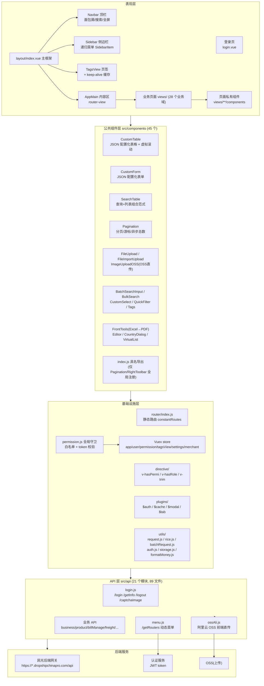
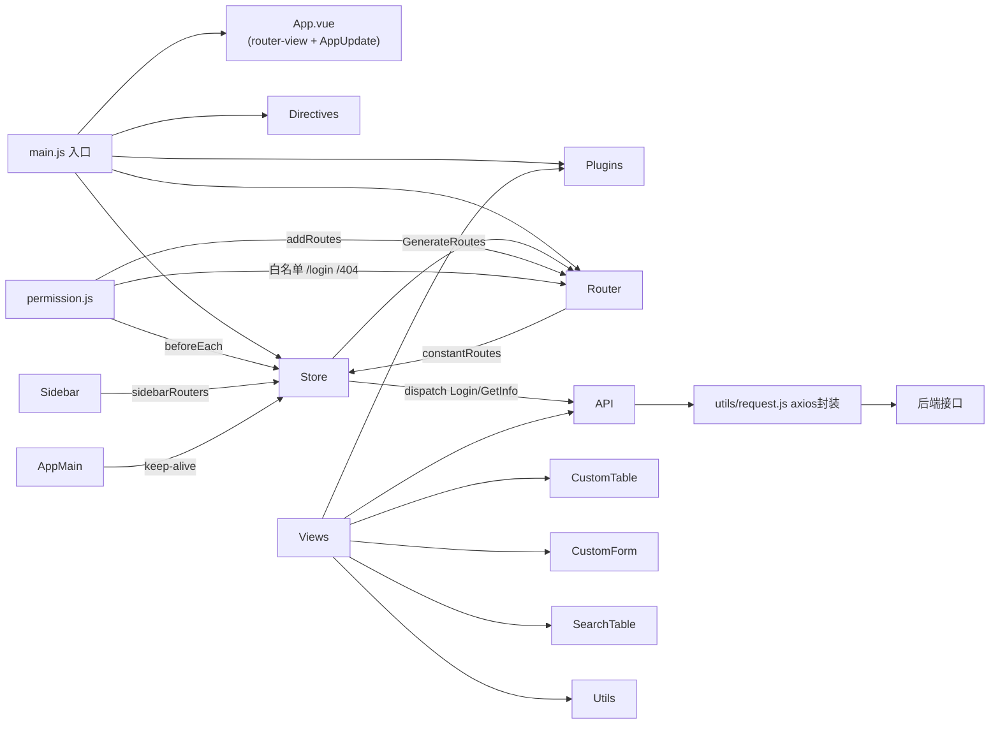
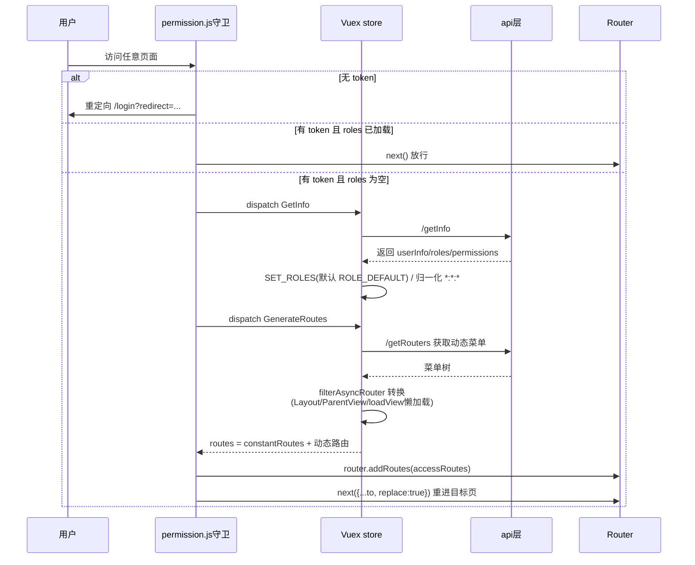
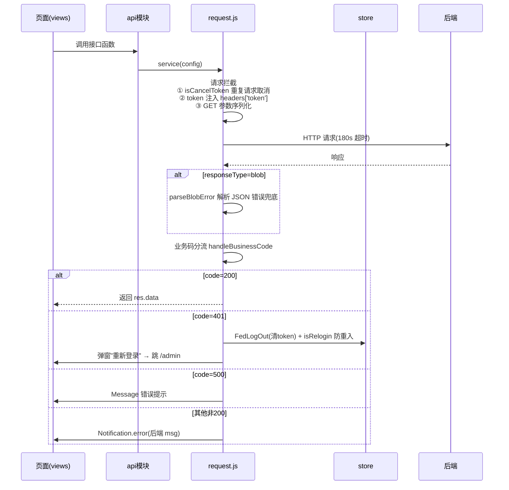
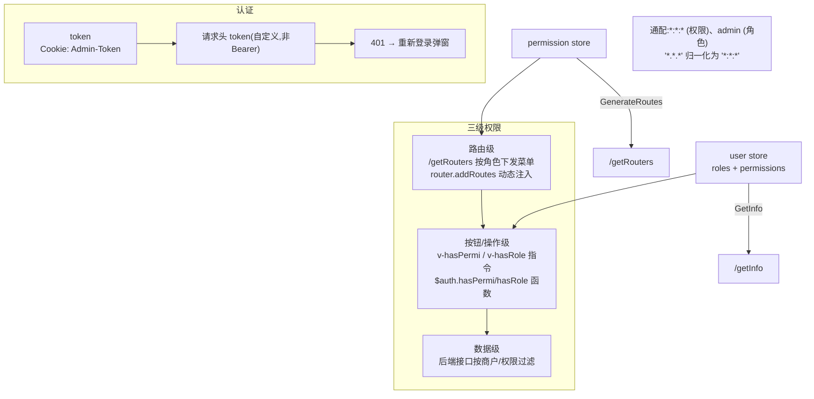
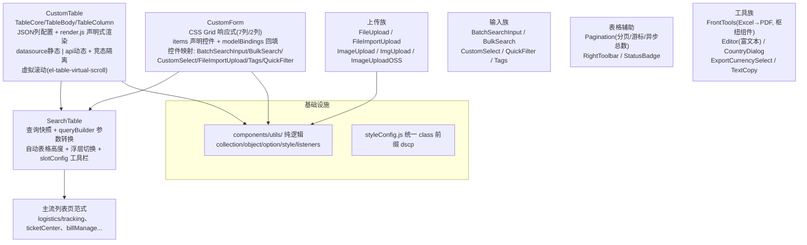
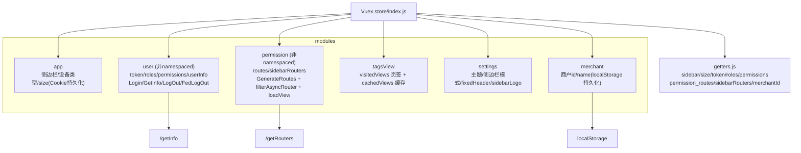
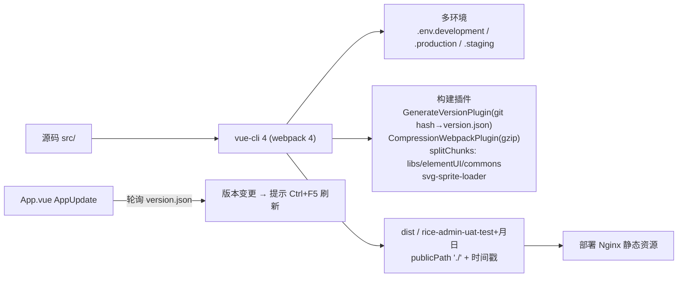

# mg-dscp-admin 前端系统架构图

> 项目:民光管理系统(rice v3.4.0)
> 技术栈:Vue 2.6 + Vue Router 3(hash 模式)+ Vuex 3 + Element UI 2.15 + axios + vue-cli 4(webpack 4)
> 数据来源:代码静态分析 + graphify 知识图谱(`graphify/all-graphify-out-0729`:7322 节点 / 10094 边 / 548 社区)

---

## 1. 总体架构分层图

---

## 2. 模块依赖关系图(文件级拓扑)

---

## 3. 登录与动态路由流程(时序图)

---

## 4. 请求链路与错误处理(时序图)

---

## 5. 权限模型图

---

## 6. 公共组件体系图

---

## 7. 状态管理(Store)模块图

---

## 8. 构建与部署流程

---

## 9. 核心枢纽节点(graphify 图谱数据)

| 排名 | 文件 | 连接数 | 说明 |
|---|---|---|---|
| 1 | `views/productsLib/quotation/components/cudQuotationNew.vue` | 188 | 报价新建(最复杂业务组件) |
| 2 | `components/FrontTools/excelFiles/ExcelToPdfTool.vue` | 120 | Excel→PDF 工具 |
| 3 | `views/afterSalesManage/afterSales/index.vue` | 101 | 售后列表 |
| 4 | `views/cw/customer/index.vue` | 95 | 财务客户 |
| 5 | `views/productsLib/quotation/index.vue` | 95 | 报价列表 |
| 6 | `views/billManage/billSummary/index.vue` | 88 | 账单汇总 |
| 7 | `views/freight/shiptplv3/index.vue` | 74 | 运费模板 v3 |
| 8 | `views/purchaseManage/placeOrderBy1688/index.vue` | 73 | 1688 下单 |
| 9 | `views/billManage/fixedPrice/components/table.vue` | 66 | 固定费用 |
| 10 | `views/billManage/billDetails/components/billOrderDetails.vue` | 65 | 账单明细 |

**图谱社区概览**(548 个社区中节点最多的):报价新建(cudQuotationNew)、账单明细(billAfterSale/billOrderDetails)、ExcelToPdfTool、quotation.js API、CustomTable 内核(TableBody/TableColumn/const.js)、resize.js 图表族、系统管理(getMenuTreeselect 社区)。

---

## 10. 目录规模统计(graphify 节点数)

| 目录 | 节点数 | 说明 |
|---|---|---|
| views/billManage | 887 | 账单管理(最大业务域) |
| views/productsLib | 708 | 产品库/报价 |
| views/business | 685 | 核心业务(订单/商户/库存) |
| views/purchaseManage | 514 | 采购(1688) |
| views/freight | 350 | 运费/物流费用 |
| views/system | 266 | 系统管理 |
| views/product | 245 | 商品管理 |
| views/membershipManage | 174 | 会员体系 |
| api/ 全目录 | 952 | API 层(21 模块) |
| components/ 全目录 | 828 | 公共组件层(45 组件) |
| utils/ | 190 | 工具层 |

---

## 11. 架构特点与风险

**特点**
- 若依(RuoYi)风格二次开发:动态路由 + 后端菜单 + 三级权限体系
- 页面主流范式:`SearchTable`(CustomForm + CustomTable 组合),大量配置化开发
- 请求层扩展点丰富:重复请求取消(`isCancelToken`)、延迟返回(`delayResponse`)、blob 错误兜底
- 大数据场景:批量请求器(Web Worker 并发)、虚拟滚动表格、async 分页总数

**风险点**
1. `utils/ossAli.js` 与 `.env` 中 OSS AK/SK 明文,前端直传无 STS 签名
2. 无 token 自动刷新机制,401 仅弹窗引导重新登录
3. `permission.js`、`request.js` 共享模块级 `isRelogin` 全局标志,存在耦合
4. 动态路由组件路径与 `src/views` 文件必须严格匹配,否则导航失败
5. 报价(`cudQuotationNew.vue`)等单组件连接数过高,复杂度过大
6. 图谱构建时间早于当前代码(commit `4454997d`),精确结论以当前源码为准
