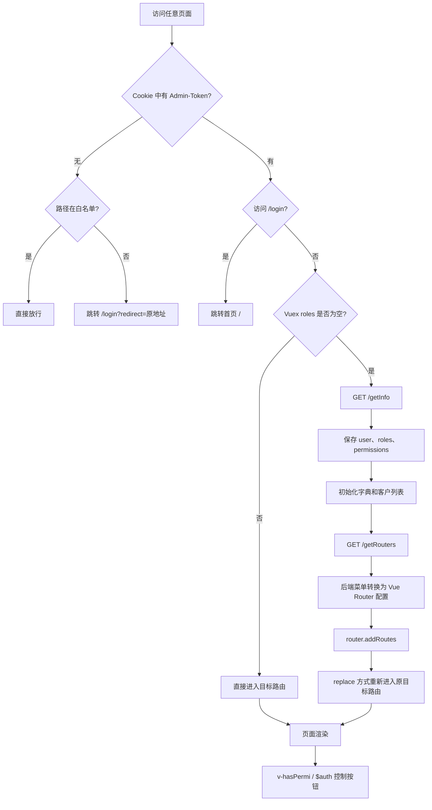

# DSCP 管理后台鉴权现状

## 一、结论概览

当前项目采用：

> Cookie Token 认证 + 后端动态菜单路由授权 + Vuex 角色/权限码 + 前端按钮权限指令。

- Token 决定用户是否登录。
- `/getInfo` 返回用户、角色和权限码。
- `/getRouters` 返回当前用户可访问的菜单和路由。
- 路由权限主要由后端菜单结果决定，前端不再按角色二次过滤。
- `permissions` 主要控制按钮和业务操作。
- `roles` 主要用于判断用户信息是否完成初始化，模板中几乎没有使用角色指令。
- 所有前端权限只用于交互和展示，最终接口安全必须由后端再次校验。

## 二、整体流程



## 三、登录流程

登录入口是 `src/views/login.vue`。

### 3.1 初始化

登录页创建时执行：

```js
created() {
  this.getCode()
  this.getCookie()
}
```

登录只提交账号和密码。`getCookie()` 会读取 `username`、`password` 和 `rememberMe`。如果之前勾选“记住密码”，会从 Cookie 中读取密码并通过 `decrypt()` 解密。

### 3.2 提交登录

点击登录后调用：

```js
this.$store.dispatch('Login', this.loginForm)
```

进入 `src/store/modules/user.js` 的 `Login` Action，随后请求：

```text
POST /login
```

实际请求体只有：

```json
{
  "loginName": "用户名",
  "password": "密码"
}
```

虽然 Action 读取了 `code` 和 `uuid`，但 `src/api/login.js` 没有将其加入请求体，因此验证码目前没有真正接入登录接口。

### 3.3 保存 Token 和恢复目标地址

登录成功后：

```js
setToken(res.token)
commit('SET_TOKEN', res.token)

// token 操作依赖于cookies
export function getToken() {
  return Cookies.get(TokenKey)
}

export function setToken(token) {
  return Cookies.set(TokenKey, token)
}

export function removeToken() {
  return Cookies.remove(TokenKey)
}
```

Token 被保存到名为 `Admin-Token` 的 Cookie。随后跳转至导航守卫保留的 `redirect`，没有目标地址时进入 `/`。

## 四、Token 保存和请求携带

Token 操作集中在 `src/utils/auth.js`：

```js
const TokenKey = 'Admin-Token'

getToken()
setToken(token)
removeToken()
```

统一 Axios 实例位于 `src/utils/request.js`。请求默认携带：

```http
token: <Admin-Token>
```

单个请求配置 `headers.isToken = false` 时不附加 Token。

项目中少数上传和下载逻辑还使用：

```http
Authorization: Bearer <token>
Token: <token>
```

因此当前至少存在三种 Token Header 约定，需要确认后端是否全部兼容，并逐步统一。

## 五、全局路由守卫

核心文件为 `src/permission.js`。

### 5.1 没有 Token

白名单为：

```js
const whiteList = [
  '/login',
  '/auth-redirect',
  '/bind',
  '/register',
  '/exceltools'
]
```

白名单使用 `to.path` 精确匹配。命中时直接放行，否则跳转：

```text
/login?redirect=原目标地址
```

### 5.2 有 Token 且访问登录页

访问 `/login` 时直接跳到 `/`，避免已登录用户继续停留在登录页。

### 5.3 有 Token 但用户上下文未初始化

系统通过以下条件判断是否已加载用户信息：

```js
store.getters.roles.length === 0
```

为空时依次执行：

```text
GET /getInfo
→ 保存用户、角色和权限
→ 初始化字典
→ 初始化客户列表
→ GET /getRouters
→ 注册动态路由
→ 重新进入目标路由
```

### 5.4 有 Token 且角色已加载

直接调用 `next()`，不再重复请求 `/getInfo` 和 `/getRouters`。

## 六、用户、角色和权限码

用户上下文由 `src/store/modules/user.js` 的 `GetInfo` Action 加载：

```text
GET /getInfo
```

响应预期包含：

```json
{
  "user": {},
  "roles": [],
  "permissions": []
}
```

### 6.1 角色处理

有角色时保存后端角色；没有角色时设置：

```js
['ROLE_DEFAULT']
```

`ROLE_DEFAULT` 的主要作用是确保 `roles.length !== 0`，避免每次导航都重复获取用户信息，并不代表真实业务角色。

### 6.2 权限码处理

超级权限码为：

```text
*:*:*
```

项目兼容后端旧格式 `*.*.*`，会统一转换成 `*:*:*`。后端可返回权限数组或单个字符串。

当前存在以下默认行为：

```js
commit('SET_PERMISSIONS', res.permissions || ['*:*:*'])
```

**即用户有角色但后端未返回 `permissions` 时，前端默认授予超级权限。这属于 fail-open 行为，建议调整为默认空数组，只在后端明确返回超级权限时放行。**

## 七、动态菜单和路由权限

核心文件为 `src/store/modules/permission.js`。

### 7.1 获取后端路由

```text
GET /getRouters
```

前端没有完整的本地业务路由表，业务菜单和页面访问范围主要由后端返回的路由树决定。

### 7.2 生成菜单路由和实际路由

后端数据被深拷贝为两份：

| 路由集合             | 用途               |
| ---------------- | ---------------- |
| `sidebarRoutes`  | 侧边栏菜单渲染          |
| `rewriteRoutes`  | 实际注册到 Vue Router |
| `constantRoutes` | 登录、首页、错误页等公共路由   |

实际路由最后追加通配 404：

```js
{ path: '*', redirect: '/404', hidden: true }
```

### 7.3 组件字符串解析

`filterAsyncRouter()` 将后端组件字符串转换为组件：

- `Layout` → `src/layout/index.vue`
- `ParentView` → `src/components/ParentView`
- 其他组件 → `src/views` 下对应 Vue 页面

页面通过 `require.context('../../views', true, /\.vue$/, 'lazy')` 懒加载。若后端配置的页面不存在，会在加载时拒绝并报告“未找到动态路由页面组件”。

### 7.4 注册动态路由

导航守卫中执行：

```js
router.addRoutes(accessRoutes)
next({ ...to, replace: true })
```

`replace: true` 用于重新匹配刚注册的动态路由，同时避免增加重复浏览历史。

### 7.5 菜单渲染

侧边栏读取 `sidebarRouters`，支持：

- `hidden`
- `alwaysShow`
- `meta.title`
- `meta.icon`
- `meta.activeMenu`
- 外链菜单

当前前端没有基于 `route.meta.roles` 或 `route.meta.permissions` 的二次路由过滤，`filterAsyncRouter()` 会保留后端返回的所有路由。因此用户能够访问哪些业务页面，主要取决于后端 `/getRouters` 返回结果。

## 八、按钮和操作权限

### 8.1 `v-hasPermi` 指令

示例：

```html
<el-button v-hasPermi="['quotation:manage:edit']">
  编辑
</el-button>
```

判断规则：

- 用户拥有 `*:*:*` 时全部放行。
- 用户权限列表与指令数组至少匹配一个时放行。
- 不匹配时直接从父节点移除 DOM。

当前源码约有 244 处权限指令引用，55 个 Vue 组件使用 `v-hasPermi`，没有发现模板实际使用 `v-hasRole`。

### 8.2 `$auth` 方法

业务 JS 中可以调用：

```js
this.$auth.hasPermi(permission)
this.$auth.hasPermiOr(permissions)
this.$auth.hasPermiAnd(permissions)
this.$auth.hasRole(role)
this.$auth.hasRoleOr(roles)
this.$auth.hasRoleAnd(roles)
```

超级角色为 `admin`，超级权限为 `*:*:*`。

### 8.3 指令限制

`v-hasPermi` 使用 Vue 2 `inserted` 钩子，只在元素首次插入时检查一次，并直接删除 DOM。因此权限动态变化后不会自动恢复元素，需要重新创建组件。该指令只控制界面展示，不提供真实安全边界。
- 使用 js 重新渲染这个组件，事件依然可以执行
- 如果调用方法暴露到 window 中，可以直接执行
- 解决方式：高阶函数包装；业务代码拦截；组件内部包含拦截；编写或者引入插件编译时动态解析完成代码注入；服务端判断；

## 九、401 和会话过期

统一请求层在业务响应码为 401 时弹出登录过期确认框。`isRelogin.show` 用于防止多个并发 401 重复弹窗。

用户选择重新登录时：

```text
FedLogOut
→ 清除 Vuex token
→ 删除 Admin-Token Cookie
→ location.href = /admin
```

用户取消时只关闭弹窗，Token 仍保留；后续请求再次返回 401 时会重新提示。

`FedLogOut` 不会清除角色、权限、用户信息、菜单和动态路由，目前依赖整页刷新清除内存状态。

## 十、白名单现状

| 路径 | 静态路由存在 | 未登录放行 | 结论 |
|---|---:|---:|---|
| `/login` | 是 | 是 | 正常 |
| `/exceltools` | 是 | 是 | 需确认是否应匿名公开 |
| `/auth-redirect` | 否 | 是 | 配置残留或缺少路由 |
| `/bind` | 否 | 是 | 配置残留或缺少路由 |
| `/register` | 否 | 是 | 配置残留或缺少路由 |

白名单只绕过前端路由守卫，不会绕过请求拦截器，也不会自动授予匿名用户后端接口权限。

## 十一、主要风险

### 高优先级

1. **权限缺失时默认授予超级权限**：`res.permissions || ['*:*:*']` 建议改为默认空数组。
	1. 接口返回的权限不存在时，默认成了最高管理员（原有设计）
2. **Token Cookie 未显式设置安全属性**：没有明确设置 `secure`、`sameSite`、`expires` 和 `path`，且 Cookie 可被 JavaScript 读取，存在 XSS（注入接口代码获取token数据） 攻击问题。
	1. 后端返回的的 token 前端存在 cookies 里面,前端可以操作 cookies
	2. 接口请求头添加了 token 参数，使用 Cookies.get 获取，第三也放可以获取
	3. 直接下载(a标签，open 等等)和新窗口请求无法添加 Header,只能在 接口后面添加 token数据，会暴露数据
		1. 下载统一使用 Blob 或短时一次性 URL
	4. 使用 tokem + cookies 来解决这个问题
	5. token 的失效时间？前端更新时机？
	6. 解决方法
		1. 同源部署 + HttpOnly Session Cookie + Redis + CSRF Token + 后端权限校验。
		2. 后端不动，前端设置token失效事件和刷新机制，更新token
3. **`/exceltools` 匿名开放**：应确认是否为明确业务要求，并检查其内部数据、下载和接口访问能力。

### 中优先级

5. **`GenerateRoutes` 没有失败分支**：`getRouters()` 只有 `then`，没有 `catch/reject`，失败时导航可能一直处于 pending。
6. **假定每个顶层菜单都有 `children`**：直接执行 `item.children.forEach`，后端返回顶层叶子路由时可能抛异常。
	1. children 和 data 没有判空
7. **`FedLogOut` 状态清理不完整**：目前依赖整页刷新，未来改成 SPA 内部跳转时可能残留旧权限。
8. **白名单存在无对应路由项**：`/auth-redirect`、`/bind`、`/register` 需要删除或补充真实用途。
9. **Token Header 不统一**：存在 `token`、`Authorization: Bearer` 和 `Token` 三种格式。
10. **记住密码保存可恢复密码**：即使经过前端加密，浏览器中的 JavaScript 同时具备解密能力，不应视为安全存储。建议只记住用户名。

### 低至中优先级

10. `v-hasRole` 已注册但没有实际模板调用。
11. 按钮权限指令不是响应式权限组件。
12. 使用 `roles.length` 同时表达真实角色和初始化状态，建议拆分 `userLoaded`、`routesLoaded`。
13. 后端菜单缺少严格结构校验，错误页面路径只在实际加载时暴露。

## 十四、影响范围

鉴权核心文件包括：

- `src/permission.js`
- `src/store/modules/user.js`
- `src/store/modules/permission.js`
- `src/utils/request.js`
- `src/utils/auth.js`
- `src/views/login.vue`
- `src/plugins/auth.js`
- `src/directive/permission/`
- `src/layout/components/Sidebar/`

按钮权限调整会影响至少 55 个业务组件；动态菜单或后端路由格式调整会影响所有后端菜单页面。

## 十五、回归测试点

1. 无 Token 访问业务页面，正确携带 `redirect` 跳到登录页。
2. 登录成功后恢复原目标路由。
3. 有 Token 首次刷新，依次加载用户信息和动态路由。
4. `/getInfo` 返回正常角色、空角色、数组权限、字符串权限和超级权限。
5. `/getRouters` 返回嵌套路由、顶层叶子路由、`Layout`、`ParentView` 和错误组件路径。
6. 白名单五个地址分别验证真实行为。
7. 普通权限、多个 OR 权限、超级权限下的按钮显示。
8. 401 并发请求只弹一次重登框。
9. 401 取消后再次请求的行为。
10. 主动退出和被动退出后 Token、菜单、角色、权限及标签页是否清空。
11. 页面刷新后动态路由不会重复注册。
12. 上传、下载、导出接口的 Token Header 是否符合后端协议。
### 十六、检查环境文件时发现，前端 `.env` 中存在 OSS AccessKey ID 和 Secret，并且变量名使用 `VUE_APP_` 前缀。
这类变量会被 Vue CLI 编译进浏览器 JavaScript，任何访问系统的人都可能获取，不能视为服务端秘密。建议立即：

1. 在云平台轮换并禁用现有密钥。
2. 从所有前端 `.env` 文件删除 Secret。
3. 检查 Git 历史和已发布静态资源。
4. 改为后端生成 OSS 临时凭证或预签名 URL。
5. 给临时凭证设置最小权限和很短的有效期。

