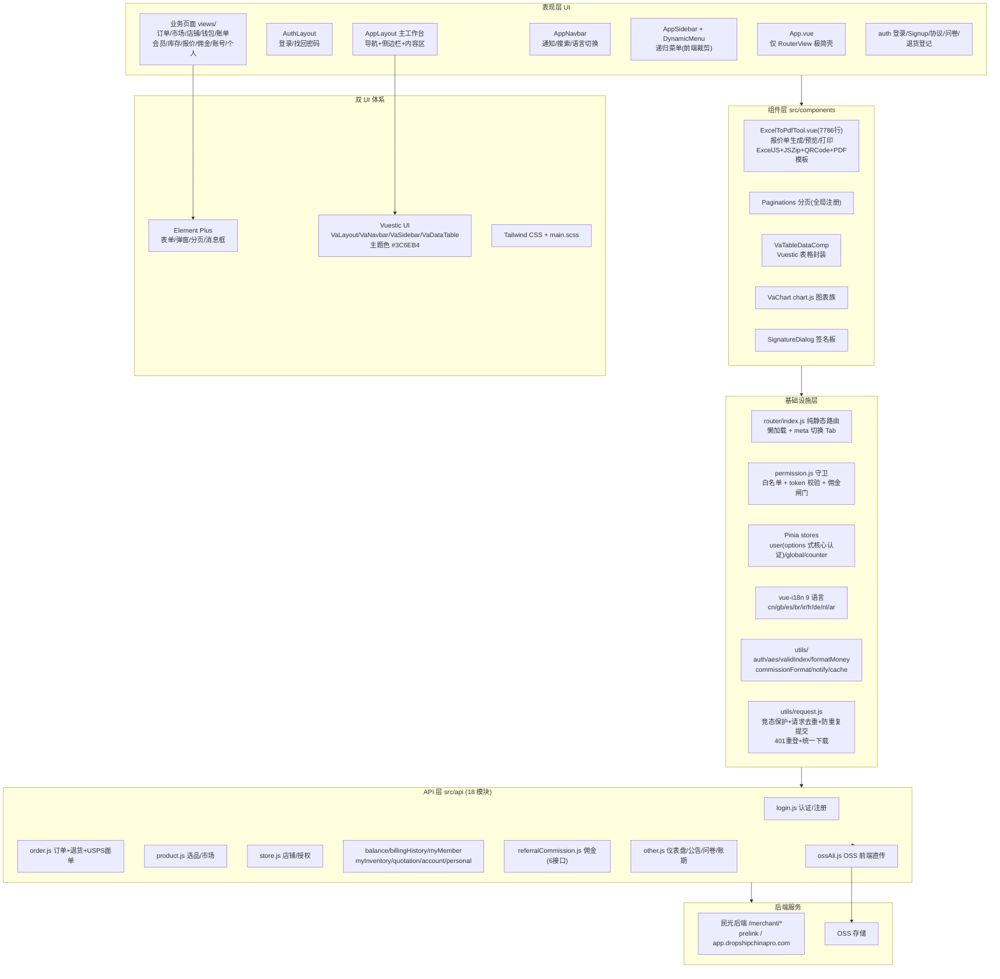
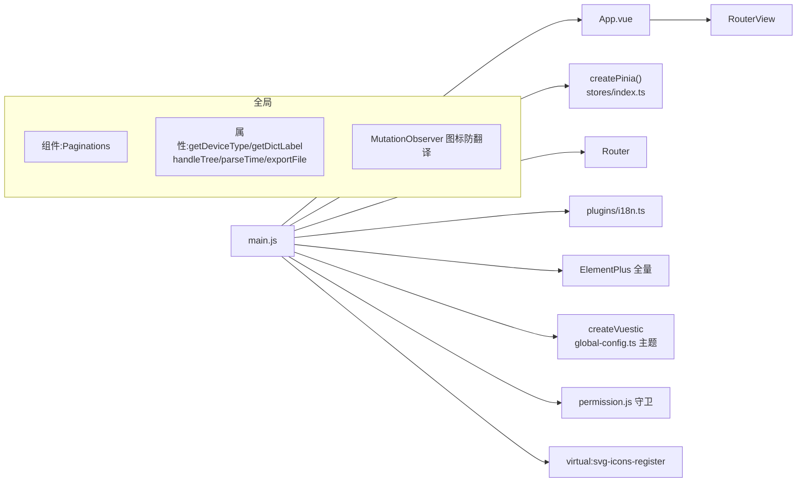
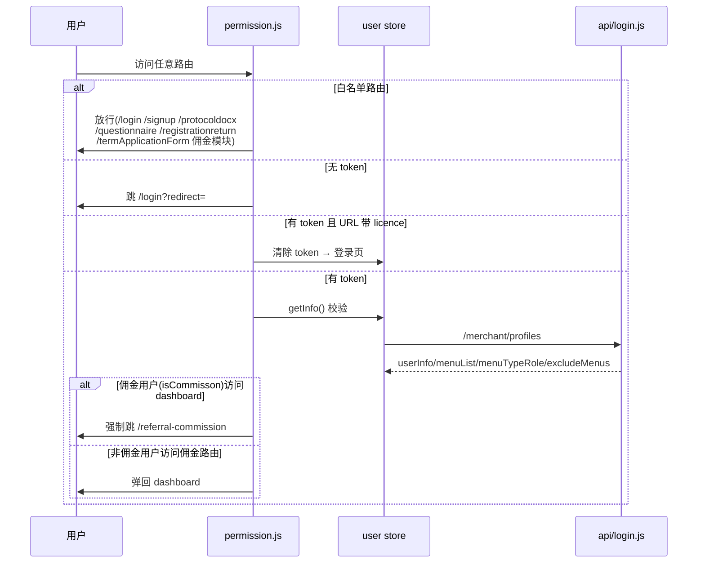
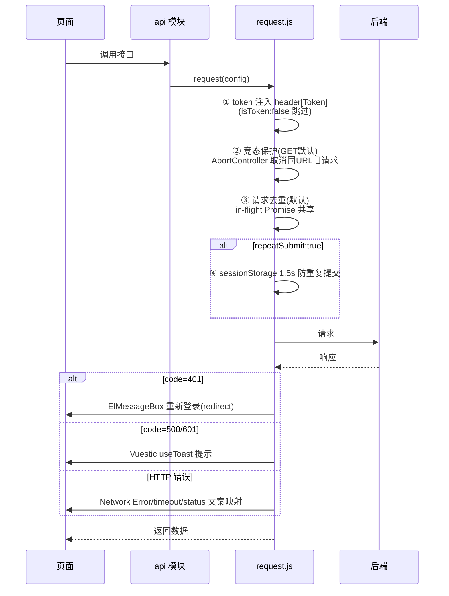
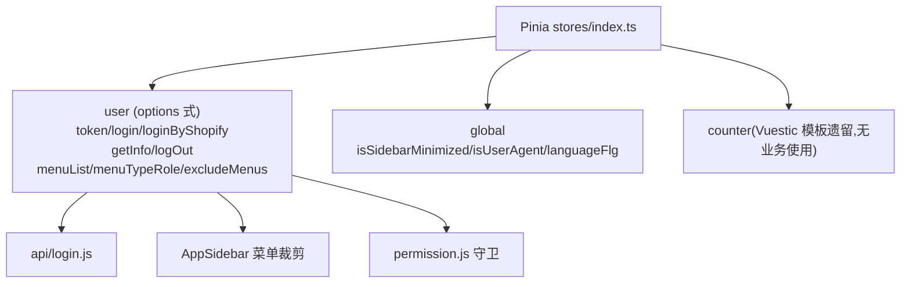
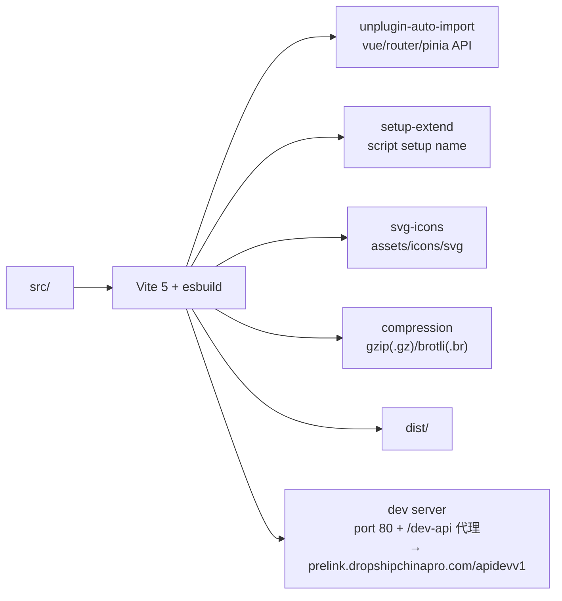

# mg-dscp-merchant 前端系统架构图

> 项目:DSCP Smart Fulfilment 商户端(跨境电商供应链商户工作台)
> 技术栈:Vue 3.5 + Vite 5 + Pinia 2 + Vue Router 4(hash)+ Element Plus 2.11 + Vuestic UI 1.10 + Tailwind CSS + vue-i18n
> 数据来源:代码静态分析 + graphify 知识图谱(`graphify-out`:1898 节点 / 2824 边 / 140 社区,commit 95d4d398)

---

## 1. 总体架构分层图

---

## 2. 入口与全局注册

---

## 3. 路由与权限模型

**菜单权限**:非动态路由,静态路由 + 前端按 `menuList`/`menuTypeRole`/`excludeMenus` 递归裁剪菜单(Administrator 全量 / Employee 白名单过滤)。

---

## 4. 请求链路(utils/request.js 核心资产)

**下载**:`download(url, params, filename)` — POST + form-urlencoded + blob 校验,非 blob 解析 JSON 报错,全屏 ElLoading。

---

## 5. Store 模块图

---

## 6. 业务域清单

| 目录 | 业务域 | 关键页面/组件 |
|---|---|---|
| `dashboard.vue` / `dashboardOld.vue` | 数据看板 | 订单分布/今日销售/热销/公告/APP推荐/帮助中心(env 切换新旧版) |
| `orders/` | 订单管理 | Tab:待提交/已提交/已完成/异常/退货;addOrders/AddReturnDialog/CreateUspsLabelDialog |
| `marketplace/` | 选品市场 | findProduct/importList/imported/ProDuctDetail/importListDetail |
| `store/` | 店铺管理 | BindStoreModal/reNameDialog/wayBillPush |
| `balance/` | 钱包 | 余额/积分/过期提醒 |
| `billingHistory/` | 账单流水 | 列表+明细 billOrderDetail |
| `paymentRecords/` | 付款记录 | JSZip 批量下载 |
| `myMembers/` | 我的会员 | 权益/返利 rebatePanel/membersHead |
| `myInventory/` | 我的库存 | 库存明细 |
| `quotation/` | 固定价报价 | expoetPDF.vue 封装 ExcelToPdfTool |
| `accountManagement/` | 子账号 | AddModal |
| `personal/` | 个人资料 | 改密码/改资料 |
| `referralCommisson/` | 佣金提成(独立模块) | CommissionLayout + 4 子页 + WithdrawDialog |
| `auth/` | 登录注册 | Login/Signup/RecoverPassword/ProtocolDocx/ModalPerFor |
| `questionnaire/` | 订单问卷(公开) | — |
| `registrationreturn/` | 退货登记(公开) | — |
| `otherPage/` | 账期申请 | termApplicationForm/SignatureDialog/SuccessDialog |

---

## 7. 核心枢纽节点(graphify 图谱数据)

| God Node | 连接数 | 说明 |
|---|---|---|
| `request()` | 132 | 请求封装,全系统总线 |
| `useUserStore` | 19 | 认证/菜单核心 store |
| `LanguageStorage` | 16 | i18n 语言持久化 |
| `formatMoney()` | 15 | 金额格式化 |
| `useGlobalStore` | 13 | 全局状态 |
| `notify` | 13 | 通知模块 |
| `storeList()` | 12 | 店铺列表 |
| `buildPreviewHtml()` | 12 | PDF 预览 HTML 构建 |

**社区规模前列**:ExcelToPdfTool.vue(54 节点)、orders/index.vue(47)、balance/index.vue(40)、dependencies(47)、AppLayout.vue(32)、CommissionManagement(36)、quotation(36)、dashboard.vue(30)。

**图谱发现的循环依赖**:
- `AppSidebar.vue → router/index.js → AppLayout.vue → AppSidebar.vue`
- `api/login.js → utils/request.js → stores/modules/user.js → api/login.js`

---

## 8. 构建配置

**环境**:`.env.development`(prelink + OSS AK/SK)、`.env.production`(app.dropshipchinapro.com/api)、`VITE_APP_OLD_PAGE` 切换新旧仪表盘。

---

## 9. 架构特点与风险

**特点**
- **双 UI 体系**:Element Plus(业务组件)+ Vuestic UI(布局框架/主题),Tailwind 辅助样式
- 请求层是全项目核心资产:竞态保护 + 去重 + 防重复提交 + 统一下载,质量高
- 菜单为"前端裁剪"而非动态路由,权限逻辑简单可控
- 9 种语言国际化,金额/日期/数字格式按语言切换
- 佣金提成为独立路由域(CommissionLayout),与主工作台隔离

**风险点**
1. **ExcelToPdfTool.vue 约 7786 行**、多个 index.vue 超千行,巨型组件亟需拆分(graphify 社区 cohesion 仅 0.03)
2. `user.isCommisson = false` 被硬编码,佣金闸门实际只走非佣金分支
3. `system/dict`、`validIndex.js` 等若依(RuoYi)遗留代码与新架构并存
4. OSS AK/SK 明文在 `.env`,前端直传无 STS 签名
5. 存在 2 处 3 文件循环依赖
6. 图谱基于 commit `95d4d398`,精确结论以当前源码为准
