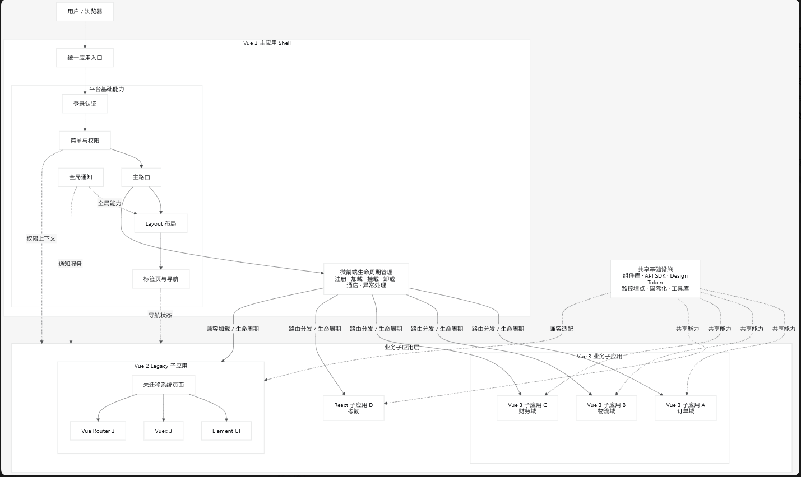

> [!111] 前因
> 运营端项目基于 vue2 相关技术栈开发，直接在现有技术栈下实现 vue3 升级难点较多，目前方案都是适配 vue2 的改造，仅仅是开发模板的改变，实质还是使用多个 vue2 runtime。且后续如果公司业务发展壮大，单一项目将会难以维持整个公司的业务体系，届时再对项目进行业务划分切割时，成本和投入将会大大增高。基于此，给出一套微前端架构的拆分模式，方便后续对运营端项目的升级，维护，拆分
- 以下微前端架构均采用 乾坤 技术
## 一、架构图


简化架构：
```text
Vue 3 主应用 Shell
├── 登录认证
├── Layout
├── 菜单与权限
├── 主路由
├── 标签页与导航
├── 全局通知
├── 微前端生命周期管理
│
├── Vue 3 子应用 A：订单域
├── Vue 3 子应用 B：物流域
├── Vue 3 子应用 C：财务域
│
└── Vue 2 Legacy 子应用
    ├── 未迁移系统页面
    ├── Vue Router 3
    ├── Vuex 3
    └── Element UI
```
## 二、登录信息共享方案
- 主应用全局存取，子应用监听变化
	- 登陆成功后，主应用将登录后的 `token`、`userInfo`、`permissions` 写入微前端框架提供的全局状态中
	- 子应用在 `mount` 时读取快照，并通过监听 API 保持同步更新。
- 配置 / Props 下发（简单直接）
	- 在 `registerMicroApps` 或 `loadMicroApp` 的 `props` 中传入 `{ token, userInfo, roles }`，子应用在 `mount(props)` 里接收。
	- 适合"登录后一次性下发"的场景；更新时需配合全局状态或重新触发加载。
- 共享拦截器 + 统一 Header（兜底）：优先考虑。将请求统一化，整套前端系统共用同一套请求处理逻辑，封装到组件库中进行维护
	- 主应用和子应用共用同一套请求封装（`src/api/request.js`），从全局状态中取 token 拼到 `Authorization` header。
	- token 变更（续期/登出）通过状态监听自动反映到所有请求
	- 适合无框架改造的 Legacy（Vue 2）子应用，改造成本低。
- Cookie / SameSite 共享（旧方案，慎用）
	- 把 token 放进主域 cookie，子应用同域可自动携带；但需注意 `SameSite`、跨域、XSS 风险，现在较少推荐
- 权限点下发而非全部下发（安全建议）
	- 子应用只需要接受对应的功能权限，不需要把所有的用户信息都分发给各个子系统
## 三、子应用管理方案
- 前端写死
	- 前端穷举所有的子应用模块，初始化时直接注入到主应用中
- 服务端控制
	- 根据用户登录时的身份信息，动态返回该所用户拥有的子应用模块
	- 前端根据返回信息动态注册子应用模块
## 四、菜单管理
- 页面layout 菜单栏部分由,主应用控制，根据接口返回的菜单信息动态注册菜单栏。（功能可以拆分到组件库中）
- 点击菜单栏触发路由状态变化，子应用根据路由规则自动匹配对应服务，并展示具体界面
## 五、主子应用通信
- **props 下发（主 → 子，一次性/低频）**
```javascript
	// 主应用
	registerMicroApps([{
		name: 'app-order',
		entry,
		container,
		activeRule: '/order',
		props: { auth: { token }, base: '/order' }
	}])
	
	// 子应用 mount 时接收
	export async function mount(props) {
	  store.commit('SET_AUTH', props.auth)   // 放入自己的状态管理
	}
```
- **GlobalState（双向、实时）** —— 乾坤官方方案
```javascript
	// 主应用
	const actions = initGlobalState({ token: '', userInfo: {} })
	window.globalActions = actions
	actions.setGlobalState({ token })   // 变更即广播
	
	// 子应用（mount 的 props 里自动带）
	props.onGlobalStateChange((state, prev) => { /* 同步更新 */ }, true)
	props.setGlobalState({ theme: 'dark' })   // 子应用也能回写
```
- **自定义事件（window + CustomEvent）** —— 浏览器API, 框架无关，Legacy 子应用友好
```javascript
// 任意一方发送
window.dispatchEvent(new CustomEvent('global:logout', { detail: { reason } }))

// 任意一方监听
window.addEventListener('global:logout', e => { /* 清理本地状态 */ })
```
- **微前端入口提供的通信（框架增强）**
	- `initGlobalState` / `onGlobalStateChange` / `setGlobalState`
- **共享单例 / 全局对象（简单场景兜底）** 直接暴露到全局，需要配套触发变更的机制，否则应用无法感知
```javascript
// 主应用暴露
window.__APP_CONTEXT__ = { ... }
// 子应用读取/写入（注意协议约定与命名空间避免冲突）

// 可以使用 Proxy 拦截对象变动，再通过自定义方法触发变更，考虑组件 私有化方法
const store = new Proxy(window.__SHARED__, {
  set(target, key, value) {
    target[key] = value
    window.dispatchEvent(new CustomEvent('shared:change', { detail: { key, value } }))
    return true
  }
})
```
## 六、主子应用部署和迭代计划

- 构建主应用，并独立部署发版
	- 具体就是 layout 模块，权限，子应用模块，菜单的加载
- 子应用搭建与路由管理
	- 具有完整layout的 子应用可以独立部署
	- 接入微前端框架下的子应用需要隐藏 layout 部分
		- layout 组件重构，识别微前端框架标识 window.__POWERED_BY_QIANKUN__ 等，主动失活 layout 组件
		- 路由跳转逻辑需要继续使用
		- 子应用需要保留在微前端框架下的url,对应 activeRule
	- 当前子应用根据 功能拆分新的组件使用新的技术栈开发
## 七、组件开发
- 通用组件在组件库中开发，跟随组件库升级发版
- 组件库通过 npm 依赖添加到对应的项目
- 业务组件根据各子应用时机业务情况在对应目录下进行开发
- 通用函数由组件库统一支持提供